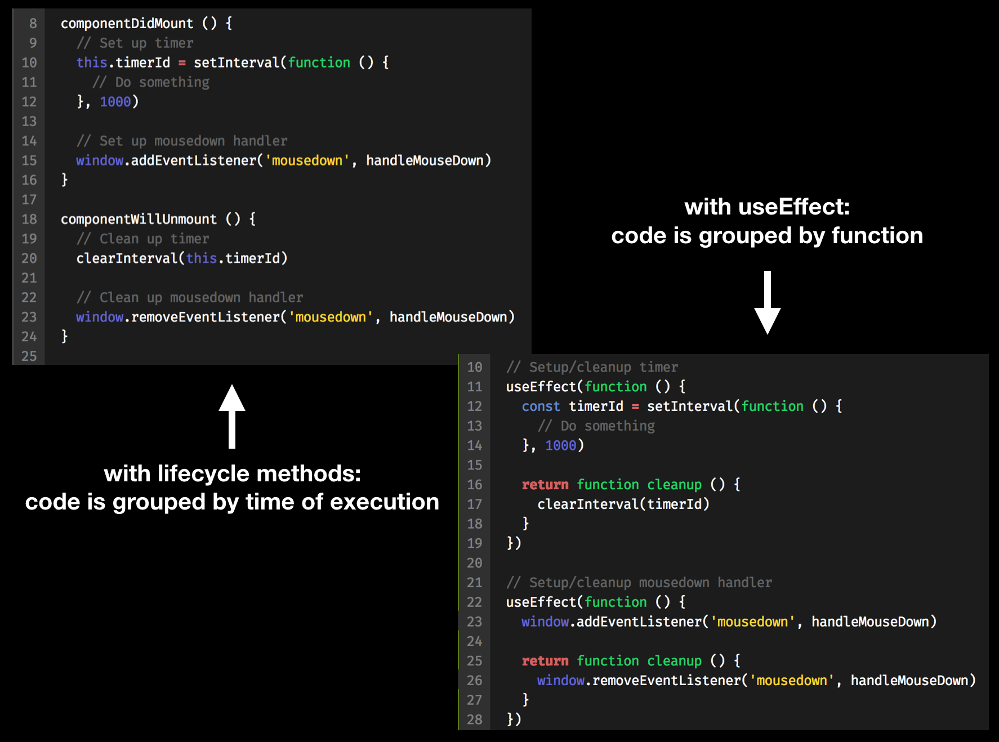

I'm a little late to the party (Hooks were officially released back in February as part of React 16.8), but I finally had the chance to spend some real time playing with React Hooks and building out some simple examples.

Whether you love them or are still skeptical, the patterns introduced with Hooks seem to be the future of React. Hooks add new possibilities for function components (they no longer need to be stateless) and give us new ways to think about side effects and "lifecycles".

Let's take a look at some examples. The examples in this post can be found [here](https://github.com/leahjlou/react-hooks-examples).

## Example 1: State in a Simple Form

We'll first take a look at the `useState` hook to manage state in a simple form.

`useState` allows you to manage state data in a function component. Before hooks, you could only manage state in a class component using `this.state`, `this.setState(...)`, etc. Now, with `useState`, you can initialize state and access an updater function directly in your function component, like this:

```
const [name, setName] = useState('Jim')
```

Here, the initial value of this piece of state data (`name`) is the string 'Jim'. The `setName` function is like your `this.setState`, but just to update this one piece of data.

Here's an example of managing state in a simple form using `useState`. Use the 'React' and 'Result' tabs to toggle between the code and the rendered result.

<iframe width="100%" height="600" src="//jsfiddle.net/leahloughran/5bhzk97w/embedded/js,result/" allowfullscreen="allowfullscreen" allowpaymentrequest frameborder="0"></iframe>

## Example 2: Side Effects with a Stop/Go Timer

In this example, we're going to use the `useEffect` hook to create a "side effect" in our component, and we'll also create our own custom hook!

### Side Effects

In the past, we've used component lifecycle methods (like `componentDidMount`, `componentDidUpdate`, and `componentWillUnmount`) to run side effects, like adding an event listener on the window or making an API request. `useEffect` is the new way to do this in function components.

`useEffect` accepts a callback function as its first argument. This function will execute after the component mounts and on every rerender. You can think of it kind of like a combined `componentDidMount` and `componentDidUpdate`. (Over time, you'll want to move away from thinking about it this way, but I think it's helpful initially.)

Your callback function should return a cleanup function if you need to clean anything up (remove event listeners, cancel API requests, etc). This cleanup function will get called when the component unmounts and on every rerender — one-to-one with the executions of the callback.

Here's how you might use `useEffect` to add a scroll listener to your window:

```
useEffect(() => {
  window.addEventListener('scroll', handleScroll)
  return function cleanup () {
    window.removeEventListener('scroll', handleScroll)
  }
})
```

`useEffect` also accepts a second argument, a “conditions array”. Think of it as “the pieces of data that this callback depends upon”.

```
// Executes on mount and on any rerender
useEffect(() => {})

// Executes on mount and anytime `name` changes
useEffect(() => {}, [name])

// Executes on mount only
useEffect(() => {}, [])
```

You can call `useEffect` as many times as you need to within your component. The great thing about this is the ability to separate concerns in lifecycle methods. Rather than grouping code by when it runs (on mount, on unmount, etc.), you can group code by _why_ it runs.



### Custom Hooks

One of the coolest thing about hooks is that you can create your own custom hooks to share stateful or “effectful” code between components. Before hooks, the primary way to do this was composing in the component tree using patterns like higher-order components and render props. Those patterns not only add cruft to your component tree, but they also mix that stateful/effecty logic with presentation code, which isn’t ideal.

To create a custom hook, just define a function. That function will probably use some of React's built-in hooks.

Let’s say your component needs to know how wide the browser window is, and it needs to “subscribe” to changes in the window width. You could create a `useWindowWidth` custom hook and grab it directly in any of your components with a single line.

```
const windowWidth = useWindowWidth()
```

Here’s what that custom hook definition might look like:

```
import { useState, useEffect } from 'react'

export default function useWindowWidth () {
  const [windowWidth, setWindowWidth] = useState(window.innerWidth)

  function handleResize () {
    setWindowWidth(window.innerWidth)
  }

  useEffect(function () {
    window.addEventListener('resize', handleResize)

    return function () {
      window.removeEventListener('resize', handleResize)
    }
  }, [])

  return windowWidth
}
```

### Put it together to make the Timer

Finally, here's the stop/go timer example that uses `useEffect` and a custom hook. It's a simple timer that counts up in milliseconds. When the mouse is pressed, the timer pauses.

We use `useEffect` to set up and clean up a timer. We create and use a custom hook, `useMousePressed`, to subscribe to the pressed state of the mouse.

<iframe width="100%" height="600" src="//jsfiddle.net/leahloughran/mn1u92t0/embedded/js,result/" allowfullscreen="allowfullscreen" allowpaymentrequest frameborder="0"></iframe>

## Example 3: Themed Blog

Here, we'll use `useContext` to create a simple "blog" with a theme picker.

Context is a really useful concept, but its API has been unstable and not particularly elegant to use until now. The `useContext` hook is a huge improvement here.

In this example, our blog has some content, featuring a colorscheme which is determined by a theme. You can choose your preferred theme from a dropdown on the top.

The theme lives in a React Context. At the top level `ArticleWrapper` component, there's a `Provider` which sets and stores the current theme and provides a function to update it. The `ThemeSwitcher` and `Article` components are rendered within the `Provider`, which both use the `useContext` Hook to easily reference the current theme from the nearest `Provider`.

<iframe width="100%" height="600" src="//jsfiddle.net/leahloughran/m0cxrhbv/embedded/js,result/" allowfullscreen="allowfullscreen" allowpaymentrequest frameborder="0"></iframe>

## Them's the Hooks!

For me, the hardest part out of everything here? Wrapping my head around `useEffect` and its second argument (the "conditions array"). I've been using React for years and I've always thought about components in terms of their lifecycles, not about what "effects" I want to run. It's definitely a new paradigm.

With time and practice, I'm finding myself gaining a deeper understanding of how these hooks work, their pitfalls, and ways to think about performance. (Spoiler alert: probably don't overthink perf.) In some ways, it feels like I'm re-learning React! This is a huge change in the way we build components, but I truly think it's in the right direction. And if you don't, class components still work just fine. :)
