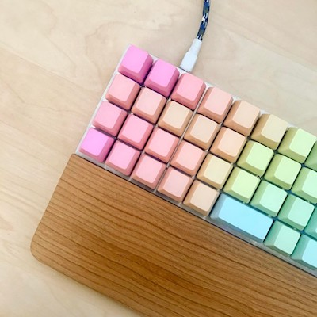
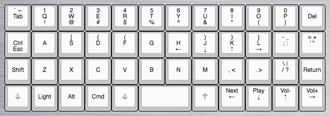

I finally got my hands on a [Planck keyboard](https://olkb.com/planck)!



The Planck is a funny little 40% mechanical keyboard with an "ortholinear" layout (the keys are aligned horizontally and vertically rather than being staggered). It’s DIY, fully programmable, and, most importantly of course, really cute.

The main consideration with a keyboard so small is there simply aren’t enough keys to represent every possible input, so you need to use layers. On the typical Planck, the two keys to the left and right of the spacebar are function keys for “lowering” and “raising” the active layer (the orange buttons in the image below).

It takes a little getting used to, but the benefit is that everything is right at your fingertips so you hardly have to move your hands or wrists at all. And in fact, I’ve been surprised by how easy it is to use the layers since the raise/lower keys are right at my thumbs. It’s way more convenient than using shift or control keys.

I decided to get one because I was interested in

1. Less wrist movement while typing
2. A keyboard that looks really tiny and cool!!! c’mon.
3. A fun project to assemble and program.

### Parts

My Planck is made up of:
* a rev 3 [Planck PCB](https://olkb.com/planck/pcb)
* a stainless steel MIT layout [top plate](http://olkb.com:80/planck/top-plate)
* a rev 3 [milled bottom](https://olkb.com/planck/milled-bottom) in silver
* [Gateron blue switches](http://mechanicalkeyboards.com/shop/index.php?l=product_detail&p=1272) (clicky goodness)
* [NPKC rainbow keycaps](http://www.massdrop.com:80/buy/npkc-rainbow-keycaps)

Now I’ve been typing on it for about two days, and so far I’ve been surprised at how much I enjoy the layout. Typing while keeping my hands on the home row is super satisfying, and the ability to program it means I can really hone in on what I want out of it. Time will tell, but it’s already well on its way to becoming my daily driver.

Kits have been available on [Massdrop](https://www.massdrop.com/) in the past, but right now you can buy parts for the Planck from [olkb.com](https://olkb.com/). Assembly is simple enough: set the top plate on the PCB, place the switches and solder them into place, then screw it into the case. If the idea of soldering intimidates you, I promise it's easier than it seems! And you can get a soldering iron from WalMart for $10 and it'll totally do the trick. [Here](https://www.youtube.com/watch?v=S2FApwzVxAQ) is a great video tutorial on how to build it.

### Programming

The fun part, in my opinion, is programming it with your own custom keymap. There are lots of instructions in various READMEs in the [QMK Firmware repo](https://github.com/jackhumbert/qmk_firmware), which is used to program all kinds of keyboards on all kinds of platforms, but here are some simple instructions specifically for Mac OS X:

#### 1. Install some things with Homebrew

```bash
brew tap osx-cross/avr
brew install avr-libc
brew install dfu-programmer
```

`avr-libc` is a library for microcontrollers, and `dfu` is a command line utility for the actual programming.

#### 2. Clone the [QMK Firmware git repository](https://github.com/jackhumbert/qmk_firmware)

```bash
git clone git@github.com:jackhumbert/qmk_firmware.git
```

#### 3. Navigate into the project's Planck keymaps directory

```bash
cd qmk_firmware/keyboards/planck/keymaps
```

#### 4. Copy the default keymap directory to a new directory called whatever name you want for your custom keymap

```bash
cp -r default mynewkeymap
```

#### 5. Open the keymap file in a text editor and make your changes

Open the file `mynewkeymap/keymap.c` in your favorite text editor.

```bash
vim mynewkeymap/keymap.c
```

Take a look around. It should be pretty self-explanatory. [Here's](https://github.com/jackhumbert/qmk_firmware/blob/master/doc/keycode.txt) a list of the key codes you can use. Make whatever changes you want, then save the file.

#### 7. Plug in your keyboard to your computer via USB

With a pin, push the reset button on the bottom of the keyboard. Then, run the following to flash the keyboard with your new keymap:

```bash
make KEYMAP=mynewkeymap dfu
```

### Done!

If you'd like to see my current layout, [here it is](http://www.keyboard-layout-editor.com/#/gists/bbfc6488fb2a6957da4396e3d7246afb), and [here is the keymap.c file](https://github.com/leahjlou/qmk_firmware/blob/master/keyboards/planck/keymaps/leah/keymap.c) in my fork of `qmk_firmware`.



The legends in the middle are the main layer, the top legends represent the “raise” layer, and the bottom legends represent the “lower” layer.

It’s basically the default layout with a few changes. The parentheses, curly braces, and brackets are in the upper layer on the home row since I use them so much writing code. My control key is by my left pinky for shortcuts in the terminal, and Esc is on the same key in the lower layer for Vim.

We’ll see how long I last before I decide I need another Planck to use at home 🙂
