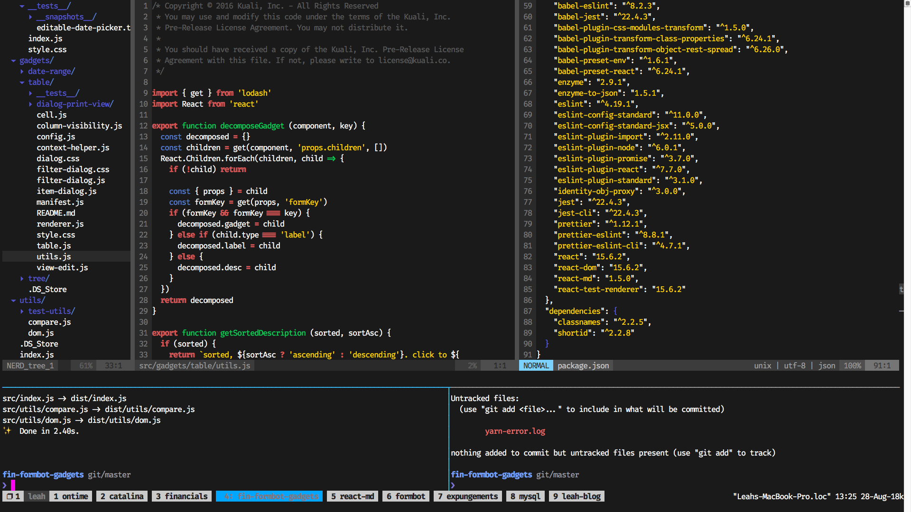
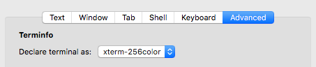
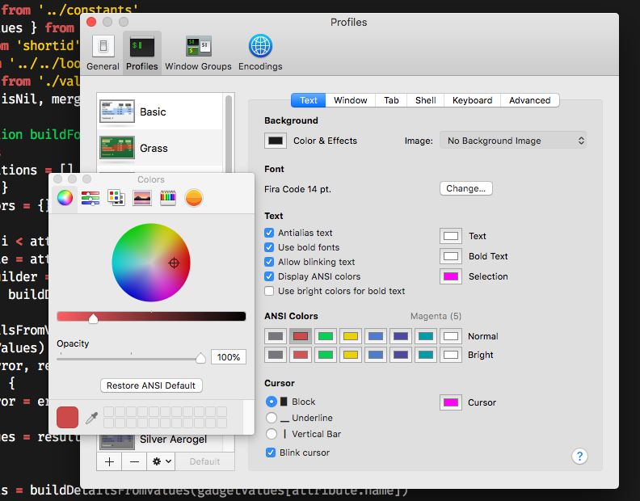
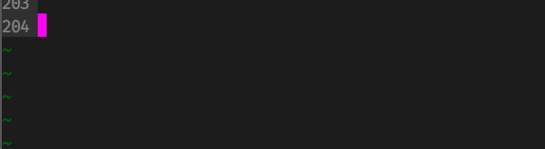

_(2018 note: this post is woefully out of date on the specifics, but 2 years later, I'm still use the same basic setup. I'm leaving the post here unedited for memory's sake.)_

A few months ago (in August), I switched from Atom to Vim and started getting serious about my terminal development environment.

I could talk about how awesome Vim is, how it’s changed my life and solved all my problems and purified all my toxins. But this post isn’t about preaching the Gospel of Vim. I just want to document my first real terminal setup.

Even though I’ve been “using the terminal” for years, I never spent a lot of time making it a nice place to be because it wasn’t the foundation of my development environment. Of course, that changed when I became A Vim User.

I’m not someone who lives for configuring things, but (with lots of guidance) I eventually ended up with something I think is pretty nice.

### Contents

* [Terminal](#terminal)
* [Vim](#vim)
* [Neovim](#neovim)
* [Vim configuration](#vim-configuration)
* [zsh](#zsh)
* [tmux](#tmux)
* [colors](#colors)
* [font](#font)
* [caps lock](#caps-lock)

### Terminal

First things first: figure out which terminal to use. There are a few options other than your system terminal. I think the two most compelling are:

* [iTerm2](https://www.iterm2.com/) — very popular among terminal power users.
* [hyperTerm](https://hyper.is/) — built on Electron using HTML/JS/CSS, which makes customizing it really accessible to web developers.

I tried these and others, and even used iTerm for the first two weeks of my setup, but I ended up going back to the OS X system terminal — Terminal.app — and I have no regrets.

* It’s lightweight, performant, and basically bug-free.
* It handles programming ligatures better than any other terminal I’ve tried. (This isn’t really a big deal, but I like them. More on those later.)

Note that Terminal.app only supports 256 colors. iTerm and hyperTerm have 24-bit color and lots of other cool features, but they just didn’t outweigh those two factors for me.

### Vim

Vim is the reason I switched to a terminal-based dev environment in the first place. It’s an old-school text editor that uses keyboard commands to navigate and manipulate text. If you’re a “power-user” of any software ever, you already understand the advantage of keyboard shortcuts (once they’re in your muscle memory, of course), and using Vim takes that to the extreme.

Vim keeps my hands on the keyboard and my ideas flowing. It’s simple and customizable, it never freezes, and it gets out of my way. More so than any other editor, it makes me feel like the computer is an extension of my brain.

If you think Vim users are just hipster neckbeards, I feel ya, but don’t totally discount it until you try it as your daily driver for at least a week or two. If being a hipster neckbeard is wrong, then I don’t want to be right.

To start out, open your terminal and type `vimtutor`. Spending 15-30 minutes a day on this for about a week will be a good primer. After you’re familiar with the basics, I recommend just going cold turkey. It’ll suck the first few days, but after about two weeks, you'll be back up to speed.

Vim is crazy powerful and flexible. You could learn a new command a day for years and still not know everything. It’s easy to get overwhelmed. Just know you can start out with the basics and still be productive, and add special commands to your workflow over time (the fun part). There are lots of resources for Vim commands, but here’s my [cheat sheet](/vim-cheat-sheet). It’s obviously not exhaustive, but it covers most of the basics as well as a few handy commands I took note of in my first week or so.

### [Neovim](https://neovim.io/)

“the future of vim.” This adds some nice stuff to Vim. It’ll make it feel a bit more user-friendly by introducing some modern interactions like being able to scroll or change the split pane size with your mouse. [Install it with homebrew](https://github.com/neovim/neovim/wiki/Installing-Neovim) (oh, and get [homebrew](https://brew.sh/) if you haven’t already!)

### Vim Configuration

Vim can be endlessly configured. As a True Vim User, your .vimrc is something that should be carefully curated line-by-line, cherished, passed down from generation to generation, and eventually engraved on your tombstone.

You can start out by enlisting the help of someone else’s dotfiles. Lots of people share them on GitHub. Here’s what I use: [cp-dotfiles](https://github.com/CanopyTax/cp-dotfiles).

It’s lightweight but comes with some really handy things that are now essential to my workflow. Even if you don’t use the same repo, these settings can of course be added to your own configuration independently. ([check out the settings folder](https://github.com/CanopyTax/cp-dotfiles/tree/master/settings), and also [Vundle](https://github.com/VundleVim/Vundle.vim), a Vim plugin manager.)

* __NERDtree__: file tree inside vim. use ctrl+\ to open it up and jump to the currently open file
* __fuzzy finder__ (ctrlp): find and open files quickly by typing “,t”
* __deoplete__: autocomplete. options pop up as you type, use ctrl+n to choose from the options
* __silver searcher__: search the content of all your files by typing “,ag” (get it? like the chemical symbol for silver?)
* __colorizer__: highlights the text of hex/rgb colors with the color they define
* __tmux navigation__: use ctrl+h/j/k/l to navigate between tmux panes (more on tmux later)
* __syntastic__: uses your linting utility of choice (defaults to eslint) to give you helpful messages every time you save a file

If you have a friend or teammate who uses Vim, ask them for recommendations. Most importantly, don’t worry too much about getting your configuration 100% perfect the first time. Start with the basics, and over time you’ll add your own settings and tools as you discover annoying or inconvenient things in your process.

### [zsh](http://sourabhbajaj.com/mac-setup/iTerm/zsh.html)

A nice shell. You won’t have to learn anything new coming from bash, but you’ll get more customizable prompts, better autocomplete, and some other handy things. [Install it](http://sourabhbajaj.com/mac-setup/iTerm/zsh.html), then you’ll want to pick a prompt theme. Check your available prompt themes with prompt -l, then choose one with prompt promptname. I like smiley or cloud. Nice and simple with handy git info when you’re inside a git directory.

If you want to really dig in and customize your prompt further, go check out ~/.zprezto/modules/prompt/functions, duplicate the one you want, give it a new name, and hack away. Remember you’ll need to reopen a terminal session to see the new prompt in your options.

I’ve also heard really good things about [fish shell](http://fishshell.com/), but I haven’t gotten around to trying it out myself yet.

### [tmux](https://tmux.github.io/)

Tmux is a _really important_ tool in my workflow now. It lets you split your terminal into panes and run multiple sessions (think tabs).

I usually have a session open for each project, where each session has a large pane on the top for Vim, and two or three small panes on the bottom for doing git stuff, running tests, running servers, watching/building, etc. You can rename each session so it’s really easy to get where you need to go.

There are a bunch of commands to manage your tmux panes. All the shortcuts I use are at the bottom of my [cheatsheet](/vim-cheat-sheet).

### Colors

Colors are important. When first switching from Atom, I was really annoyed that my Vim/terminal colors looked like garbage when Atom has such a pretty default colorscheme. But we can fix it!

First, we’ll need to make sure that everything is set up for 256 colors (not 24-bit, since Terminal.app doesn’t support that).

* In your Terminal.app preferences, go into your default profile, and make sure the setting under “advanced” is declared as “xterm-256color”.

* Make sure you don’t have anything in your .vimrc that enables 24 bit color or “true color”. Look for "true" or "tc" or anything like that. If you find something, remove/comment it. You might have this if you’ve installed neovim.
* Same thing with tmux. Check your `.tmux.conf` for the line that looks like `set -g terminal-overrides ",xterm-256color:Tc"`, remove/comment it, and add `set -g default-terminal screen-256color`.
* You might not need to do this, but just in case, I recommend adding the line `set background=dark` in your `.vimrc`. (Or light, but I’m gonna just assume you want a dark theme…???)

Now you’re ready to try out some colorschemes. Here are some of my favorites to get you started: [brogrammer](https://github.com/marciomazza/vim-brogrammer-theme), [hybrid](https://github.com/w0ng/vim-hybrid), [apprentice](https://github.com/romainl/Apprentice), [sierra](https://github.com/AlessandroYorba/Sierra), [tender](https://github.com/jacoborus/tender.vim). You can find more at [vimcolors.com](http://vimcolors.com/) and really go crazy if you want.

To install the “hybrid” colorscheme, for example, copy the hybrid.vim file into `~/.vim/colors`, then try it out by opening a file in vim and typing `:colorscheme hybrid`. If you decide you like it and want it to be your default colorscheme, add a line with `:colorscheme hybrid` to the bottom of your `.vimrc`.

### Bonus: getting terminal colors to match Vim colors

Terminal colors are configured in the Terminal.app profile preferences under “Background” and “ANSI Colors”. Some color schemes come with terminal colors you can download and use, but it’s also really easy (and worth it) to get your terminal to match all by yourself: there’s a color picker which you can use to grab colors straight from your code.

If this seems like too much work, just use one of the pre-loaded profiles, and maybe just change the background color to match your Vim background color.

### Font

You can choose your font, size, and weight under your Terminal.app profile settings.

Some fonts include programming ligatures to make programming operators pretty. This is totally optional and a matter of personal taste. According to my personal taste, ligatures are the best. Download and install the font [Fira Code](https://github.com/tonsky/FiraCode) and enable it under your Terminal profile settings.

Open a file in Vim and type in some programming symbols like `!==` or `=>`. Hellooooooo handsome.

### Caps lock

I don’t know who decided to put the most useless key in such a prime spot on the keyboard, but let’s remap it because you’ve probably never purposely caps-lock‘d in your entire life.

The options are endless (well, not literally, but, uh, there are a lot of options). I think these two make the most sense:

1. Remap the caps lock key to escape. This is one of the most commonly used keys in Vim so it makes sense. Unless you have a reprogrammable keyboard, you’ll need third-party software to do this, like [Seil](https://pqrs.org/osx/karabiner/seil.html.en).
2. Remap the caps lock key to control. You can use __ctrl+[__ as your escape, plus you get a handier control key for all your other commands. You can do this in your OS X system preferences under the keyboard settings.

It just comes down to personal preference. I chose option 2, as have most of my Vim-using teammates.

### The End

Well, we’ve done it. We’ve reached Terminal Nirvana. Now we can relax and enjoy our hard work by getting some work done.
